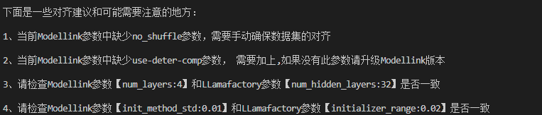

# Lf-Ml-compare-tools

#### 介绍
此工具旨在方便开发者进行Llamafactory与Mindspeed-LLM微调精度对齐。

精度对齐第一步需要确保配置保持一致，但不同框架间的参数命名、参数含义、参数默认值等等可能都存在偏差，因此在不同框架间保持配置对齐需要具备非常熟悉两个仓库的能力，而且如果是第一次对齐的话需要耗费大量的时间和精力。

此工具将Llamafactory与Mindspeed-LLM框架的大部分可能会影响微调精度的参数进行了汇总，并内置了参数的映射关系，考虑了参数默认值之间的差异，对框架间的参数含义进行换算，只需要将两个框架的参数配置文件路径作为输入，便会回显精度对齐建议，使用方式简单易用。

下图是执行工具后的输出：
<p align="center">  </p>


#### 使用配套

当前工具配套的ModelLink版本为1.0.RC4，Llamafactory版本为v0.9.0，支持向上兼容，且对应的代码都已放在此项目对应目录下。
如果框架版本低于配套的可能会出现一些参数不匹配的现象，仅供参考。

#### 使用说明

以qwen-7b模型为例：
```shell
python compare.py \
    --hf-config ./example/config.json \
    --modellink-config ./example/Modellink_qwen_7b.log \
    --llamafactory-config ./example/Llamafactory_qwen_7b.yaml
```

【--hf-config】
`--hf-config`指定为权重的config.json所在路径

【--modellink-config】
`--modellink-config`指定为Modellink参数日志所在路径，需要包含参数的打印信息，具体可参考`./example/Modellink_qwen_7b.log`

【--llamafactory-config】
`--llamafactory-config`指定为Llamafactory配置所在路径

【注意事项】

1、Llamafactory配置中需要包含`world_size`参数


